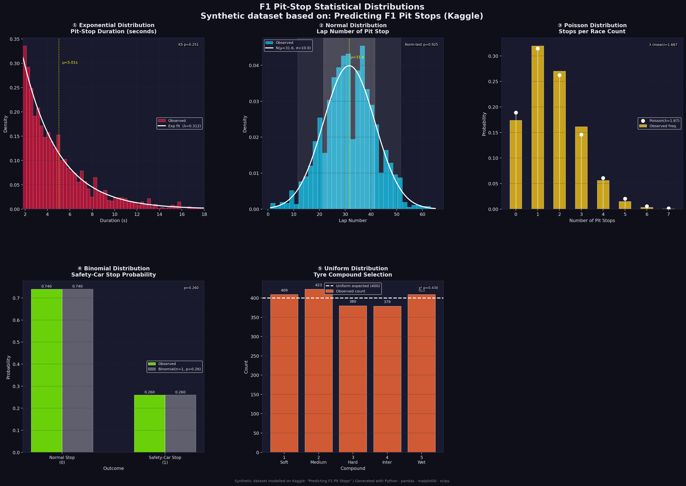

# Box Box Box
### Family Distribution on Pit Stop - Synthetic Dataset

Statistical distribution analysis of Formula 1 pit-stop data, modelled on the Kaggle dataset *"Predicting F1 Pit Stops"*. Five distributions fitted and visualized across 2,000 synthetic observations.

---

## Demo

> [Explanation Video](https://drive.google.com/file/d/FILE_ID/view?usp=sharing)

---

## Preview



---

## Charts

| Plot | Distribution | Variable | Key Stat |
|---|---|---|---|
| **Top Left** | Exponential | Pit-stop duration (seconds) | μ = 5.01s, λ = 0.312 |
| **Top Center** | Normal | Lap number of pit stop | μ = 31.6, σ = 10.0 |
| **Top Right** | Poisson | Number of stops per race | λ = 1.67 |
| **Bottom Left** | Binomial | Safety-car stop probability | p = 0.26 |
| **Bottom Right** | Uniform | Tyre compound selection | χ² p = 0.430 |

---

## Dataset

Synthetic — generated with `numpy` to mirror real F1 pit-stop structure.

| Feature | Distribution | Parameters |
|---|---|---|
| `pit_duration` | Exponential | scale = 3.2, shift = +1.8s |
| `lap_number` | Normal | μ = 32, σ = 10, clipped [1, 65] |
| `stops_per_race` | Poisson | λ = 1.7 |
| `safety_car_stop` | Binomial | n = 1, p = 0.25 |
| `tyre_compound` | Uniform | integers 1–5 (Soft/Med/Hard/Inter/Wet) |

> Based on: [Predicting F1 Pit Stops — Kaggle](https://www.kaggle.com/datasets/anthonytherrien/predicting-f1-pit-stops-vault)/)

---

## Setup

```bash
git clone (https://github.com/saintpeas/FamilyDistroPT.git)
pip install numpy pandas matplotlib scipy
python f1_famdistro.py
```

---

## Stack


